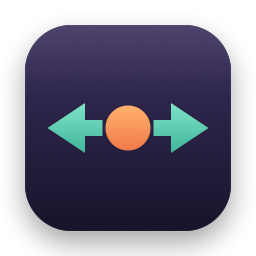

<p align="center">
  
</p>

<h1 align="center">Thumb Gestures</h1>

<p align="center">Mission Control and Space switching on the Logitech MX Vertical thumb button. No Logi Options+.</p>

---

## Why

The Logitech MX Vertical has a button on top of the thumb rest. Only Logi Options+ can assign an action to it. The button sends no normal mouse button event, so other remap tools cannot see it.

Thumb Gestures is a tiny background app that gives the button these actions:

| Input | Action |
|---|---|
| Click the thumb button | Open Mission Control |
| Hold the thumb button and move the mouse left | Switch to the Space on the right |
| Hold the thumb button and move the mouse right | Switch to the Space on the left |

The direction is the same as a trackpad swipe with natural scrolling. One hold switches one Space. The pointer stays in place during a hold.

## How it works

Thumb Gestures talks to the mouse through the Logitech HID++ protocol on the Unifying receiver, the same channel that Logi Options+ uses. It tells the mouse to send the thumb button presses and the movement during a hold to the app ("divert"). The app then sends the macOS shortcuts ⌃← or ⌃→ ("Move left/right a space"), or opens Mission Control.

The mouse forgets the divert when it sleeps or reconnects. The app sends it again after a reconnect, a wake from sleep, or a receiver plug-in. When the app stops, it gives the button back to the mouse.

## Requirements

- macOS 13 or later
- Xcode Command Line Tools (`xcode-select --install`)
- A Logitech MX Vertical on a Logitech Unifying receiver (USB ID `046d:c52b`). Bluetooth and Bolt receivers are not supported yet.
- The "Move left a space" and "Move right a space" shortcuts enabled in System Settings > Keyboard > Keyboard Shortcuts > Mission Control (they are enabled by default).

## Install

1. Clone the repo and run the installer:
   ```bash
   git clone https://github.com/EduardsE/thumb-gestures.git
   cd thumb-gestures
   ./install.sh
   ```
2. Open System Settings > Privacy & Security > Accessibility and turn on **Thumb Gestures**. If it is not in the list, click **+** and select `/Applications/Thumb Gestures.app`.

The installer builds `Thumb Gestures.app`, copies it to `/Applications`, and adds a LaunchAgent so it starts at login. After you give the permission, Thumb Gestures starts on its own within about 15 seconds.

To open the Accessibility settings directly:

```bash
open "x-apple.systempreferences:com.apple.preference.security?Privacy_Accessibility"
```

## Uninstall

```bash
./uninstall.sh
```

Then remove **Thumb Gestures** from System Settings > Privacy & Security > Accessibility.

## Options

The switch distance is the horizontal movement, in mouse counts, that starts a Space switch. The default is 600 (about 1.5 cm at 1000 DPI). To change it:

```bash
defaults write local.thumbgestures.ThumbGestures SwitchDistance -int 800
launchctl kickstart -k gui/$(id -u)/local.thumbgestures.ThumbGestures
```

## Test without installing

```bash
./build.sh
"build/Thumb Gestures.app/Contents/MacOS/ThumbGestures" --verbose
```

`--verbose` prints each button event and movement. When you run it from a terminal, macOS checks the Accessibility permission of the terminal app, not of Thumb Gestures. Press Ctrl-C to stop. The app then gives the button back to the mouse.

## Troubleshooting

- **Nothing happens.** Check the log at `~/Library/Logs/ThumbGestures.log`. It must show `Thumb button ready`. If it says it is waiting for permission, turn on Thumb Gestures in the Accessibility settings.
- **Do not run Logi Options+ at the same time.** It also takes control of the button.
- **The Space does not switch.** Make sure that you have more than one Space (a full-screen app is a Space), and that the Mission Control shortcuts are enabled.
- **It stopped after a reinstall.** Each build has a new ad-hoc signature, so macOS can drop the permission. Turn it off and on again in the Accessibility settings.
- **The button does nothing after a crash.** The mouse still diverts the button. Turn the mouse off and on to give the button back.

## Notes

- Tested with a Logitech MX Vertical on a Unifying receiver.
- Works next to [Scroll Split](https://github.com/EduardsE/scroll-split).

## License

[MIT](LICENSE)
